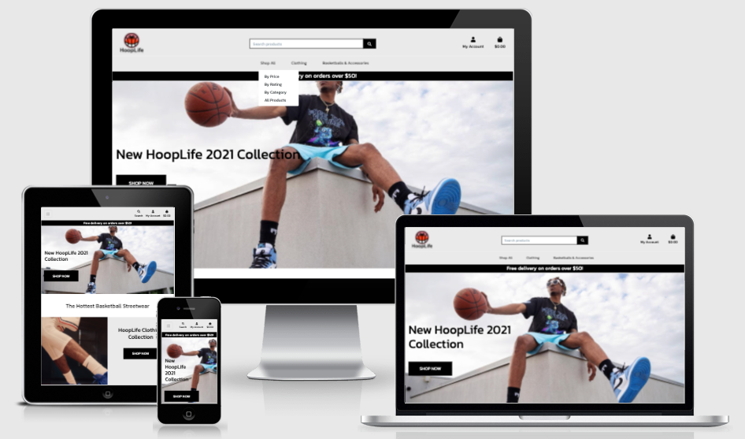
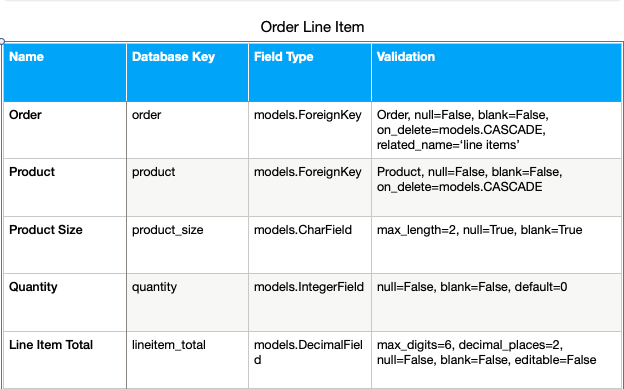

# HoopLife

This project is an Ecommerce store for people who wish to view and purchase the latest on on and off court basketball fashion. Basketball is the 3rd most watched and played sport globally, with millions of followers around the world. In western cultures basketball has also shaped the world of fashion and music with many celebrities sporting basketball attire in their day to day wardrobe. 

HoopLife aims to unite fans of basketball fashion and accessories around the world. We stock, sell and ship the most coveted brands of in game and retro clothing any basketball fan could wish for. Come visit our website. ## [HoopLife](https://ms4-hooplife.herokuapp.com/)

# CONTENT QUICK LINKS
## [UX](#wireframes)
## [FEATURES](#available-features)
## [SITEMAP](#sitemap-layout)
## [DATABASE](#database-schema)
## [SECURITY](#security-features)
## [TECHNOLOGIES](#technologies-used)
## [TESTING](#testing-steps)
## [DEPLOYMENT](#deployment-process)
## [CREDITS](#code-credits)
## [ACKNOWLEDGEMENTS](#my-acknowledgements)
## [DISCLAIMER](#my-disclaimer)

# UX

# Wireframes:
My initial wireframes and database schemas were sketched on paper and when I was happy I was going in the correct direction I used [Balsamiq](https://balsamiq.com/wireframes/) to finalise my mockups for the front end. Having viewed the websites of major sporting Ecommerce players such as Nike and JD Sports, I decided I wanted my website to be simple with minimal but popular products that would sell while also give a retro feel to the design.

* [Wireframes](wireframes/hooplife-wireframes.pdf)

# User Stories:

## Viewing & Navigation user stories:

## Registration & User Accounts user stories:

## Sorting & Searching user stories:

## Purchasing & Checkout user stories:

## Admin & Store Management user stories:

## Reviews user stories:

## Wishlist user stories:

## Strategy:
### What am I making?
A website/app that offers users to sign up/ Login/ Browse products & purchase products/ Write data to the database in the form of reviews/ view, edit and delete their orders and order history/ Add and remove products to a wishlist and checkout bag/ Receive confirmation emails/ Checkout securely using Stripe payments. 
Admin will be able to mangage products by editing, adding or deleting either directly from the site manage products page or in the admin dashboard. 
The site will cater for basketball lifestyle culture fans as well as athletes. A small selection of highly demanded products are on offer and these have been choosen from competitor market research sales using reliable software. We only stock items that we know will sell in colors and fabrics that have a proven track record among consumers.
As well as creating an attractive secure and responisve webiste all care will be taken to ensure a quick sales funnel for users. To ensure a low abandon cart rate the checkout system is simple and effective with user delivery details also saved to their profile to ensure a speedy checkout on their return to the webiste.

### Website business goals
1. Create a website that caters directly for basketball fans as opposed to cluttering the site with all sporting genres.
1. Sell products that have proven high sales rates and that are light weight and easy to ship worldwide 
1. Make user experience a priority in way of an attractive site with images of transparent background that blend into the page body.
1. Guide user's quickly and efficiently through the sales funnel to a successful checkout.
1. Build a new brand based on consumer engagement and trust. 
1. Use social media links to grow our presence online and increase organic traffic.

### Website target audience
1. Basketball lifestyle and streetwear fans of all ages and genders.
1. School and college basketball teams in need of jerseys and basketballs.
1. Individual athletes competing in the sport of basketball.

### User value
1. Users will gain a positive emotional experience from using the site. We will serve only the sport of basketball so we know our website visitors are on our site with intent which will in turn reduce bounce rates and further grow our organic ranking in SERPS.
1. Users will find signing in, and checking out an enjoyable and uncomplicated affair.
1. Users will be able to save and view their order and delivery details and also receive confirmation via email that their order has been processed.

### What users can expect
1. An easy to navigate no fuss website that is pleasant to use.
1. Easy to sign up quickly and begin browsing and adding products to their cart.
1. The ability to view, edit and delete products in their cart.
1. The ability to view and update their delivery information.
1. The ability to view their order history on their profile page. 
1. The ability to leave reviews once they sign up for an account. 
1. The ability to save items to a wishlist so they can purchase them at a later date.

### What is worth doing
1. Registration functionality
1. Log in functionality 
1. A User profile page
1. A user default delivery details form that can be updated
1. Show a user's order history on their profile page
1. Give users the ability to add reviews
1. A search box to allow users to enter keywords based on database key values so users can browse the entire database efficiently
1. A user wishlist page
1. A checkout page which allows a user to increment or decrement prouduct quantities before checking out
1. A product details page
1. Divide products in categories and order by price and rating
1. An attractive home page that shows user's immediately upon landing what HoopLife is all about. 
1. Appriate call to action buttons to guide user's toward  a successful checkout.
1. Social media icons and links
1. Admin product management

### What makes it a good experience
1. Simple outlay. 
1. Clean images with transparent backgrounds placed in bootstrap image cards of the same heights.
1. Familar simple navigation
1. The most important information is given to the user when they need it
1. Simple checkout process
1. The ability to save user info
1. High quality products that user's will keep coming back for

## Scope:

### Features for this release
1. Sign up form.
1. Log in form.
1. User delivery details edit form. 
1. User order history.
1. Clickable image cards to show full product descriptions
1. Search functionality to browse the entire database.
1. Stripe checkout page
1. Shopping bag
1. Option to adjust size and quantity of items in bag
1. Confirmation emails 
1. Organise products by price, rating and category
1. Reviews for registered account holders
1. Wishlist for registered account holders
1. Call to action buttons based on information hierarchy
1. Social media links
1. Admin product management
1. Admin CMS (Content management system)

### User requirements
1. The ability to view and add products to their shopping bag
1. The ability to create reviews and wishlists
1. The ability to edit delivery details
1. The ability to delete items from their shopping bag
1. The ability to securely checkout
1. The ability to view their order history
1. The ability to follow the brand on social media
1. The ability to view images

### How we will achieve these requirements
1. By creating good database models and relationships
1. By adding attractive image cards and simple styling
1. By implementing appropriate user forms
1. By implementing access to parts of the site otherwise hidden for non registered users
1. Appropriate social links in the footer
1. Using an attractive hero image and branding on the home page

## Structure:

### Navigation
I have implemented a multi page site. A user must sign up or log in to access certain pages
of the website.
Non account holders may access:
1. Home
1. Products and product details
1. Search products
1. Read only reviews
1. Shopping bag
1. Secure Checkout
1. Log In
1. Sign Up
1. The header also contains the company logo which has a return to home link.

Account holders will gain additonal access to:
1. My Profile - (profile page to show all of user's orders and delivery details)
1. Add reviews - (form to allow user to add reviews)
1. Wishlist - Add and remove items from a wishlist page
1. Log Out

Admin will gain access to:
1. Manage Products - (Form to allow admin to add, edit or delete products directly from the site)
1. Manage reviews - (Admin can delete innappropriate or offensive reviews)
1. Django admin CMS - (Fully customisable backend content management system where admin can control all database models from accounts to products and emails)

I have used a fixed navigation bar to allow users to move to any other section from their current section. Navigation has been kept simple and obvious. There are also call to action buttons and text to encourage new visitors to create an account. 

## Skeleton:

### Presentation
1. Simple layout
1. Hero images on home page
1. Quality product images
1. Sleek forms
1. Fixed navigation
1. All content mobile responsive
1. Consistent layout and theme

### User conventional tools
1. Clear headings. 
1. Clickable elements clearly labelled. 
1. Easy to read nav bar. 
1. Social media links in the form of clickable icons in the footer. 

### Progressive disclosure
I have placed the priority content on the home page so the user sees this first.
I have arranged the supporting content in order of priority in additional sections. 
Each section links to the most important items to engage users and encourage a conversion
in the form of a successfully checkout and sales funnel completion.

### Elements that have priority
1. Navigation menu with fixed scrolling.
1. Clickable logo with return to home link.
1. Image cards of fixed height.
1. Call to action buttons and links to encourage a sale. 
1. Social media links.

## Surface

### Colors
The website is inspired by [Global Hooper](https://globalhooper.com/). I always liked the simple retro style of the site. I used Kanit as my font for its elegant and retro style. 
I have stuck with a white body background except on the home page where I used touches of light grey to accent the navbar and some backgrounds for headings and call to action buttons. 
My navbar and footer are also black with white text. I choose these colors for the clean look of black and white while the light grey adds a retro touch while also allowing all colors to blend nicely for the visually impaired.

### Fonts
For all fonts I have use Kanit in black text with some text elements muted. I browsed through google fonts and this one stood out to me for it's elegant and slightly retro look.

### Images 
The home page uses a hero image of young cool model wearing retro basketball apparel. Basketball is not only a sport but also a culture and fashion made popular by many of today's hip hop and music stars such as Drake and Post Malone.

The home page also features two hero images of professional basketball athletes which will entice players who are serious about the sport and their gear. 
All other images come from database product entries. 
I have created neat bootstrap cards of fixed height to display all images with continuity. When the image cards are clicked the user is brought to the full product detail page where they can choose size and quantity before adding the product to their bag. 

When planning for this project I choose all my images carefully and spent some time on photoshop cleaning them up and making their backgrounds transparent so they fit into the website background nicely.
I also used photoshop to design the company logo which is a combination of a basketball and a palmtree. Palmtrees can be seen on many of the cool beach street ball courts around the USA.

### Other themes
1. Use of relevant font awesome icons to add a professional touch
1. Free delivery banner based on shopping bag total to urge user's to purchase more products

## **[BACK TO TOP](#content-quick-links)** *

# AVAILABLE FEATURES

### Navbar
The nav bar is fixed to enhance user experience.
Drop down menus have been incorporated for User account links and Product links.
Users can shop by, price, rating and category.

### Home
The home page is laid out with eye catching hero images and call to action buttons to encourage users
to start browsing and adding products to their bag. 

### All Products
The all products page uses bootstrap cards to render product images and details to the page. Each card can be clicked and this brings the user to the product details page. 

### Product Details
When a user clicks on a product they are brought to the product details page where they have the option of choosing quantities and adding the product to their shopping bag. There is also the option for users to read reviews on this page if they exist or adding a review if they are a logged in user. Logged in users can also add products to their wishlist from the product details page. The wishlist can then be view in their account dropdown.

### Profile 
The profile page shows the user's order history and also default delivery details with the option to update the delivery details form. 

### Product Management
A superuser has the addition of a link to product management in their account, where they can directly add, edit or delete products using the product management form. I have implemented some defensive programming using a bootstrap modal to prevent deleting reviews by accident.

### Wishlist
A logged in user can add items to a my wishlist template where they can be saved to be added to their shopping bag at a later date. Wishlist items can also be removed.

### Reviews
Non logged in users have the option to read reviews for each product and logged in users can review specific products using the add review form. Superusers also have the ability to delete reviews if they do not meet the code of conduct. I have implemented some defensive programming to prevent deleting reviews by accident.

### Shopping Bag
Website vistitors and authenticated users alike can add products to their shopping bag and adjust quantities. 

### Checkout
Website vistitors and authenticated users alike can securely checkout using Stipe. An instance of the user's delivery details for that order is automatically saved to users profile page.

### Sign Up
New user's may sign up for an account for a better user experience and also to access some features such as saving checkout details, adding reviews and creating wishlists. I have used crispy forms to render a more attractive template form.

### Log in
Returning users may log in using built in Django allauth functionality. Crispy forms has been used all forms on the website.

### Footer
I have added social media links and contact details in the footer. All social media icons are clickable and work in external tabs.
I also added copyright details.

### Confirmation Emails
Users will be sent a confirmation email that their order has been received after the checkout process.

## Features to add for future releases:
There are some features that I would love to implement on future releases:

### Social Media Sign Functionality:
Allow returning user's to sign in more quickly and securely using social accounts.
### Suggested Products:
Suggest products to returning users based on their order history.
### Order tracking and fullfillment functionality:
Allow users to track to orders and allow admin to manage orders and shipping.
### Inventory:
Implement functionality to allow users to implement inventory checks automatically and apply the appropriate 'only 4 left' or 'sold out' messages to the product template. Also allow users to be notified when a product is back in stock.
### Discount Codes: 
Implement functionality to check if a product has a certain amount left in stock against its original stock count. If the product is selling poorly use a 3rd party api to generate coupon codes to allow user's to avail of discounts.

## **[BACK TO TOP](#content-quick-links)** *

# Sitemap Layout
The site map was designed using [Lucid Chart](https://www.lucidchart.com/pages/)

## **[BACK TO TOP](#content-quick-links)** *

# Data Modelling: 

## Profiles App

## Products App

## Checkout App

## Review App

## Wishlist App

## **[BACK TO TOP](#content-quick-links)** *

# TECHNOLOGIES USED

1. [Balsamiq](https://balsamiq.com/wireframes/)
* I found Balsamiq an extremely usefull platform to design mock ups and get a feel of how my website would look before coding.

2. [HTML 5](https://en.wikipedia.org/wiki/HTML)
* HTML is the main mark up language used to design my website.

3. [CSS 3](https://en.wikipedia.org/wiki/CSS)
* All HTML elements were styled to my own personal taste using CSS language.

4. [Javascript](https://www.javascript.com/)
* Javascript was used to auto close flash messages and to validate the select dropdown on all forms.

5. [Jquery](https://jquery.com/)
* Jquery was used to show and hide elements on the document and also trigger modals and mobile navigation drop down.

6. [Bootstrap 4.5](https://getbootstrap.com/docs/)
* In order to help style my website as well as making the layout responsive I used the bootstrap CDN.

7. [Font Awesome](https://fontawesome.com/)
* All icons have been sourced and added from the free version of font awesome.

8. [Gitpod](https://www.gitpod.io/)
* I used git pod as my IDE workspace to write and run all code. I used Git as my version control to commit and push all code to my GitHub repository.

9. [Github](https://github.com/)
* I used GitHub to store my Git commits and back up all code.

10. [W3C HTML validator](https://validator.w3.org/)
* I used the W3C validation service to ensure all HTML code passed validation.

11. [W3C CSS validator](https://jigsaw.w3.org/css-validator/)
* I used the W3C validation service to ensure all CSS code passed validation.

12. [Jshint validator](https://jshint.com/)
* Jshint was used to ensure all javascript code passed validation.

13. [PEP8 validator](http://pep8online.com/)
* PEP8 online was used to ensure all python code passed all PEP8 industry standards.

14. [Python extends class validator](https://extendsclass.com/python-tester.html)
* extendsclass was used to ensure all python syntax passed validation.

15. [Lucid Chart](https://www.lucidchart.com/pages/)
* Lucid chart was used to create the sitemap.

16. [db diagram](https://dbdiagram.io/home)
* Db diagram was used to create my database schema.

17. [PIP](https://pip.pypa.io/en/stable/)
* PIP was used to install all packaging tools.

18. [Am I responsive](http://ami.responsivedesign.is/)
* AM I responsive was used to create attractive screenshots from all devices to display on my README file.

19. [Python3](https://www.python.org/download/releases/3.0/)
* Python is the chosen backend programming language.

20. [Django](https://www.djangoproject.com/)
* Django was used as a complete framework for all backend functionality. All backend database data is injected to html templates using django templating tags. It comes with built in user and admin functionality. 

21. [SQLite3](https://www.sqlite.org/index.html)
* SQLite is the default relational database that is install when setting up the Django framework. I later migrated to postgres database on deploying my site.

22. [Postgresql](https://www.postgresql.org/)
* Postgres is my chosen database for the final project which is hosted in Heroku.

23. [Heroku](https://id.heroku.com/login)
* Heroku was used as the hosting platform for this project.

24. [Photoshop](https://www.adobe.com/ie/products/photoshop.html)
* I used Adobe photoshop to create the company logo, error images and favicon.

25. [Chrome Developer Tools](https://developers.google.com/web/tools/chrome-devtools)
* Throughout the development process I used chrome developer tools for debugging and also to keep checking any changes I was making looked good on all devices.

26. [WAVE web accessibility tool](https://wave.webaim.org/)
* I used WAVE to make check any errors that my site may have which would effect users with hearing or visual disabilities.

27. [a11y](https://color.a11y.com/)
* I used a11y to get my color contrast between background and text as accessible as possible without comprimising my vision for the website design.

28. [CSS Autoprefixer](https://autoprefixer.github.io/)
* I used Autoprefixer to ensure all of my css styles would work on all browsers.

29. [Stripe](https://stripe.com/ie)
* I used stipe test api to take secure payments from users on the checkout page.
30. [Amazon AWS](https://aws.amazon.com/)
* I created an Amazon AWS account to host static files for my website in order to maintain my site's performance and scalability.

## **[BACK TO TOP](#content-quick-links)** *

# Testing Steps

## Click to view [TESTING.md](https://github.com/Joe2308/hooplife-ms4/blob/main/TESTING.md)

## **[BACK TO TOP](#content-quick-links)** *

# Deployment Process

## Local Deployment
### Required tools:
* [Python3](https://www.python.org/download/releases/3.0/)
* [PIP](https://pip.pypa.io/en/stable/)
* [Gitpod](https://www.gitpod.io/)
* [Amazon AWS S3 bucket](https://aws.amazon.com/)

### Create a local copy:

### Directions: 
1. On GitHub, navigate to the main page of the repository [https://github.com/Joe2308/hooplife-ms4]. 
2. At the top of the repository, select the Code drop down and copy the Clone URL.

3. In your IDE workspace, open a Terminal window and use the cd command to change the directory to where you want the cloned directory to be made and type git clone and paste in https://github.com/Joe2308/hooplife-ms4.git.
4. Click enter and the project will be created and cloned locally.

### Working with the local copy:
1. Install all the project dependencies from the terminal window of your IDE by typing: pip3 install -r requirements.txt.
2. Create an env.py file to contain the environment variables, which should include the following:
* Add import os to the top of the file
### Set the environment variables:
* os.environ['SECRET_KEY'] = 'Django secret key
* os.environ['DEVELOPMENT'] = 'True'
* os.environ['STRIPE_PUBLIC_KEY'] = 'Stripe public key'
* os.environ['STRIPE_SECRET_KEY'] = 'Stripe secret key' (A test key was used in this project)
* os.environ['STRIPE_WH_SECRET'] = 'Stripe signing secret' (Webhook endpoint key)
* os.environ['DATABASE_URL'] = 'Postgres url'

4. In order to prevent sensitive information such as secret keys and database passwords being pushed to your public github repository you need to create a .gitignore file in the root directory of the project and add the env.py file.

5. Apply database migrations using: 'python manage.py migrate'

6. Create a new superuser with: 'python manage.py createsuperuser'

7. Type python3 manage.py in your terminal to run the app locally.

## Deployment to Heroku

## Note:
Before deploying to Heroku if you have a large selection of products on an eccommerce store it is worth dumping the product and category models to a json file from your sqlite db, these can then be loaded to the postgres database instead of having to add all products manually after deploying. 

To deploy the app to Heroku from the repository, the following steps were actioned:

1. Log In to Heroku.
2. Select Create new app from the dropdown menu in the dashboard.
3. Choose a unique app name and select the closest location.
4. Below Resources locate Heroku Postgres and add it to the app.
5. In the CLI, install dj_database_url and psycopg2 to use Postgres on the deployed site.
6. pip3 install dj_database_url
7. pip3 install psycopg2
8. Log into Heroku via the CLI - 'heroku login -i' and enter login details for your Heroku account.
9. Migrate the SQLite database into Postgres - 'heroku run python manage.py migrate'
10. Create a new superuser - 'python manage.py createsuperuser'
11. Install gunicorn - 'pip3 install gunicorn'
12. Freeze the app's requirements - 'pip3 freeze > requirements.txt'
13. Create a Procfile and include - 'web: gunicorn hooplife-ms4.wsgi:application'
14. Temporarily disable Heroku's static file collection as we will be using Amazon AWS to host static files - 'heroku config:set DISABLE_COLLECTSTATIC=1 --app hooplife-ms4'
15. Add the hostname of the Heroku app to settings.py - ALLOWED_HOSTS = ['hooplife-ms4.herokuapp.com', 'localhost']
16. In Heroku, click the Settings tab and under Config Vars choose Reveal Config Vars.
Enter the following keys and values, which can be found in your env.py and settings files:

* AWS_ACCESS_KEY_ID	variable goes here
* AWS_SECRET_ACCESS_KEY	variable goes here
* DATABASE_URL	added by Heroku when Postgres installed
* DISABLE_COLLECTSTATIC	1 variable to be deleted later
* EMAIL_HOST_PASS	variable goes here
* EMAIL_HOST_USER	variable goes here
* SECRET_KEY	variable goes here>
* STRIPE_PUBLIC_KEY	variable goes here
* STRIPE_SECRET_KEY	variable goes here
* STRIPE_WH_SECRET	different from env.py
* USE_AWS	True

### Deploy automatically from github:
* Click on the deployment tab in Heroku
* Choose your github profile and add your repository name.

* Press the search button and when it is found click the connect to this app button.
* Return to the Deploy tab and under Automatic deploys select Enable Automatic Deploys.
* In the GitPod CLI add, commit and push all changes and Heroku will automatically deploy the app.
* git add .
* git commit -m "Initial commit"
* git push
* To launch the deployed site, select Open App from its page within Heroku.
* Heroku will initiate a new build each time we push new code to the github repository. 

## Storing Static Files
The media files for the deployed site are hosted in AWS S3 Bucket. In order to successfully use this service the following needs to be set:

* AWS account
* Bucket Policy
* Group
* Access Policy
* User
Once these settings are implemented, AWS needs to be connected to Django using the following steps:

1. Install boto3, django-storages and update the requirements.txt file.
2. In settings.py, add storages to INSTALLED APPS as well as the code below. Then create a custom_storages.pyfile.

* AWS provides a csv file for download of user secret variables these can now be added to Heroku config vars in the settings tab.
* Remove the DISABLE_COLLECTSTATIC variable from Convig Vars and deploy the Heroku app.
* In AWS, create a new folder called media next to the static folder and upload any required media files to it, making sure they are publicly accessible in Permissions.

## **[BACK TO TOP](#content-quick-links)** *

