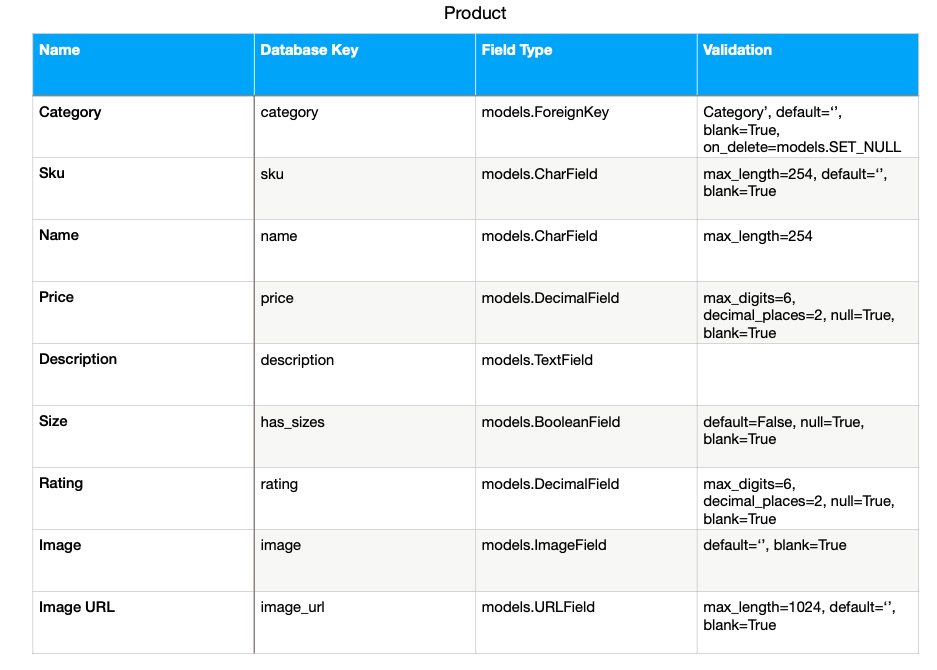

# HoopLife

This project is an Ecommerce store for people who wish to view and purchase the latest on on and off court basketball fashion. Basketball is the 3rd most watched and played sport globally, with millions of followers around the world. In western cultures basketball has also shaped the world of fashion and music with many celebrities sporting basketball attire in their day to day wardrobe. 

HoopLife aims to unite fans of basketball fashion and accessories around the world. We stock, sell and ship the most coveted brands of in game and retro clothing any basketball fan could wish for. Come visit our website. ## [HoopLife](https://ms4-hooplife.herokuapp.com/)

# CONTENT QUICK LINKS
## [UX](#wireframes)
## [FEATURES](#available-features)
## [SITEMAP](#sitemap-layout)
## [DATABASE](#database-schema)
## [SECURITY](#security-features)
## [TECHNOLOGIES](#technologies-used)
## [TESTING](#testing-steps)
## [DEPLOYMENT](#deployment-process)
## [CREDITS](#code-credits)
## [ACKNOWLEDGEMENTS](#my-acknowledgements)
## [DISCLAIMER](#my-disclaimer)

# UX

# Wireframes:
My initial wireframes and database schemas were sketched on paper and when I was happy I was going in the correct direction I used [Balsamiq](https://balsamiq.com/wireframes/) to finalise my mockups for the front end. Having viewed the websites of major sporting Ecommerce players such as Nike and JD Sports, I decided I wanted my website to be simple with minimal but popular products that would sell while also give a retro feel to the design.

* [Wireframes](wireframes/hooplife-wireframes.pdf)

# User Stories:

## Viewing & Navigation user stories:

## Registration & User Accounts user stories:

## Sorting & Searching user stories:

## Purchasing & Checkout user stories:

## Admin & Store Management user stories:

## Strategy:
### What am I making?
A website/app that offers users to sign up/ Login/ Browse products & purchase products/ Write data to the database in the form of reviews/ view, edit and delete their orders and order history/ Add and remove products to a wishlist and checkout bag/ Receive confirmation emails/ Checkout securely using Stripe payments. 
Admin will be able to mangage products by editing, adding or deleting either directly from the site manage products page or in the admin dashboard. 
The site will cater for basketball lifestyle culture fans as well as athletes. A small selection of highly demanded products are on offer and these have been choosen from competitor market research sales using reliable software. We only stock items that we know will sell in colors and fabrics that have a proven track record among consumers.
As well as creating an attractive secure and responisve webiste all care will be taken to ensure a quick sales funnel for users. To ensure a low abandon cart rate the checkout system is simple and effective with user delivery details also saved to their profile to ensure a speedy checkout on their return to the webiste.

### Website business goals
1. Create a website that caters directly for basketball fans as opposed to cluttering the site with all sporting genres.
1. Sell products that have proven high sales rates and that are light weight and easy to ship worldwide 
1. Make user experience a priority in way of an attractive site with images of transparent background that blend into the page body.
1. Guide user's quickly and efficiently through the sales funnel to a successful checkout.
1. Build a new brand based on consumer engagement and trust. 
1. Use social media links to grow our presence online and increase organic traffic.

### Website target audience
1. Basketball lifestyle and streetwear fans of all ages and genders.
1. School and college basketball teams in need of jerseys and basketballs.
1. Individual athletes competing in the sport of basketball.

### User value
1. Users will gain a positive emotional experience from using the site. We will serve only the sport of basketball so we know our website visitors are on our site with intent which will in turn reduce bounce rates and further grow our organic ranking in SERPS.
1. Users will find signing in, and checking out an enjoyable and uncomplicated affair.
1. Users will be able to save and view their order and delivery details and also receive confirmation via email that their order has been processed.

### What users can expect
1. An easy to navigate no fuss website that is pleasant to use.
1. Easy to sign up quickly and begin browsing and adding products to their cart.
1. The ability to view, edit and delete products in their cart.
1. The ability to view and update their delivery information.
1. The ability to view their order history on their profile page. 
1. The ability to leave reviews once they sign up for an account. 
1. The ability to save items to a wishlist so they can purchase them at a later date.

### What is worth doing
1. Registration functionality
1. Log in functionality 
1. A User profile page
1. A user default delivery details form that can be updated
1. Show a user's order history on their profile page
1. Give users the ability to add reviews
1. A search box to allow users to enter keywords based on database key values so users can browse the entire database efficiently
1. A user wishlist page
1. A checkout page which allows a user to increment or decrement prouduct quantities before checking out
1. A product details page
1. Divide products in categories and order by price and rating
1. An attractive home page that shows user's immediately upon landing what HoopLife is all about. 
1. Appriate call to action buttons to guide user's toward  a successful checkout.
1. Social media icons and links
1. Admin product management

### What makes it a good experience
1. Simple outlay. 
1. Clean images with transparent backgrounds placed in bootstrap image cards of the same heights.
1. Familar simple navigation
1. The most important information is given to the user when they need it
1. Simple checkout process
1. The ability to save user info
1. High quality products that user's will keep coming back for

## Scope:

### Features for this release
1. Sign up form.
1. Log in form.
1. User delivery details edit form. 
1. User order history.
1. Clickable image cards to show full product descriptions
1. Search functionality to browse the entire database.
1. Stripe checkout page
1. Shopping bag
1. Option to adjust size and quantity of items in bag
1. Confirmation emails 
1. Organise products by price, rating and category
1. Reviews for registered account holders
1. Wishlist for registered account holders
1. Call to action buttons based on information hierarchy
1. Social media links
1. Admin product management
1. Admin CMS (Content management system)

### User requirements
1. The ability to view and add products to their shopping bag
1. The ability to create reviews and wishlists
1. The ability to edit delivery details
1. The ability to delete items from their shopping bag
1. The ability to securely checkout
1. The ability to view their order history
1. The ability to follow the brand on social media
1. The ability to view images

### How we will achieve these requirements
1. By creating good database models and relationships
1. By adding attractive image cards and simple styling
1. By implementing appropriate user forms
1. By implementing access to parts of the site otherwise hidden for non registered users
1. Appropriate social links in the footer
1. Using an attractive hero image and branding on the home page

## Structure:

### Navigation
I have implemented a multi page site. A user must sign up or log in to access certain pages
of the website.
Non account holders may access:
1. Home
1. Products and product details
1. Search products
1. Read only reviews
1. Shopping bag
1. Secure Checkout
1. Log In
1. Sign Up
1. The header also contains the company logo which has a return to home link.

Account holders will gain additonal access to:
1. My Profile - (profile page to show all of user's orders and delivery details)
1. Add reviews - (form to allow user to add reviews)
1. Wishlist - Add and remove items from a wishlist page
1. Log Out

Admin will gain access to:
1. Manage Products - (Form to allow admin to add, edit or delete products directly from the site)
1. Manage reviews - (Admin can delete innappropriate or offensive reviews)
1. Django admin CMS - (Fully customisable backend content management system where admin can control all database models from accounts to products and emails)

I have used a fixed navigation bar to allow users to move to any other section from their current section. Navigation has been kept simple and obvious. There are also call to action buttons and text to encourage new visitors to create an account. 

## Skeleton:

### Presentation
1. Simple layout
1. Hero images on home page
1. Quality product images
1. Sleek forms
1. Fixed navigation
1. All content mobile responsive
1. Consistent layout and theme

### User conventional tools
1. Clear headings. 
1. Clickable elements clearly labelled. 
1. Easy to read nav bar. 
1. Social media links in the form of clickable icons in the footer. 

### Progressive disclosure
I have placed the priority content on the home page so the user sees this first.
I have arranged the supporting content in order of priority in additional sections. 
Each section links to the most important items to engage users and encourage a conversion
in the form of a successfully checkout and sales funnel completion.

### Elements that have priority
1. Navigation menu with fixed scrolling.
1. Clickable logo with return to home link.
1. Image cards of fixed height.
1. Call to action buttons and links to encourage a sale. 
1. Social media links.

## Surface

### Colors
The website is inspired by [Global Hooper](https://globalhooper.com/). I always liked the simple retro style of the site. I used Kanit as my font for its elegant and retro style. 
I have stuck with a white body background except on the home page where I used touches of light grey to accent the navbar and some backgrounds for headings and call to action buttons. 
My navbar and footer are also black with white text. I choose these colors for the clean look of black and white while the light grey adds a retro touch while also allowing all colors to blend nicely for the visually impaired.

### Fonts
For all fonts I have use Kanit in black text with some text elements muted. I browsed through google fonts and this one stood out to me for it's elegant and slightly retro look.

### Images 
The home page uses a hero image of young cool model wearing retro basketball apparel. Basketball is not only a sport but also a culture and fashion made popular by many of today's hip hop and music stars such as Drake and Post Malone.

The home page also features two hero images of professional basketball athletes which will entice players who are serious about the sport and their gear. 
All other images come from database product entries. 
I have created neat bootstrap cards of fixed height to display all images with continuity. When the image cards are clicked the user is brought to the full product detail page where they can choose size and quantity before adding the product to their bag. 

When planning for this project I choose all my images carefully and spent some time on photoshop cleaning them up and making their backgrounds transparent so they fit into the website background nicely.
I also used photoshop to design the company logo which is a combination of a basketball and a palmtree. Palmtrees can be seen on many of the cool beach street ball courts around the USA.

### Other themes
1. Use of relevant font awesome icons to add a professional touch
1. Free delivery banner based on shopping bag total to urge user's to purchase more products

# Data Modelling: 

## Profiles App

## Products App

## Checkout App

