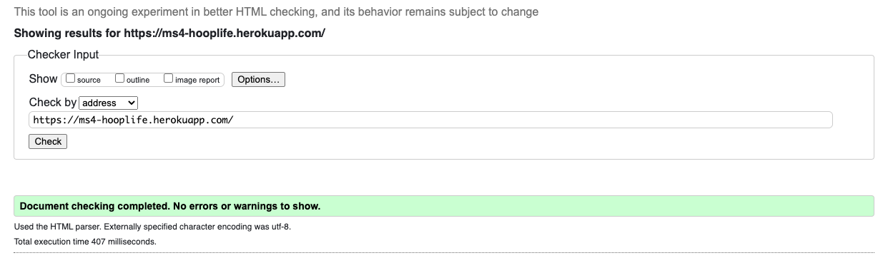
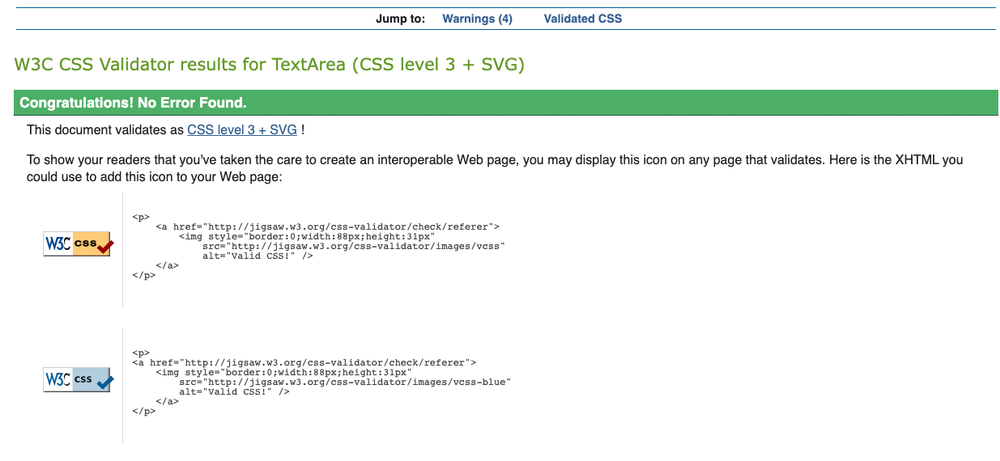
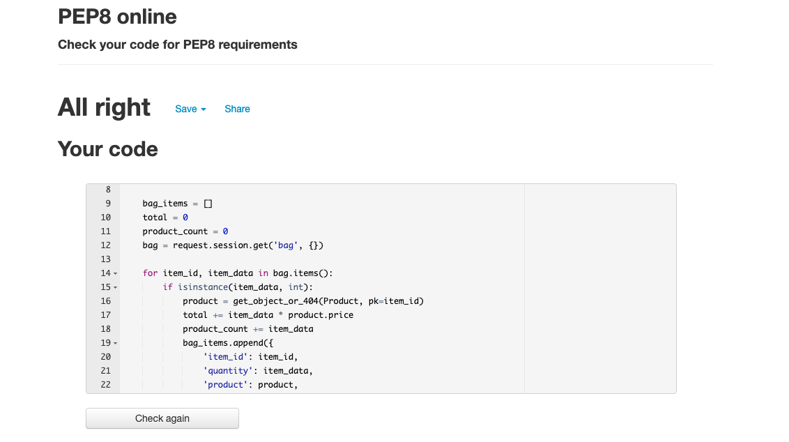
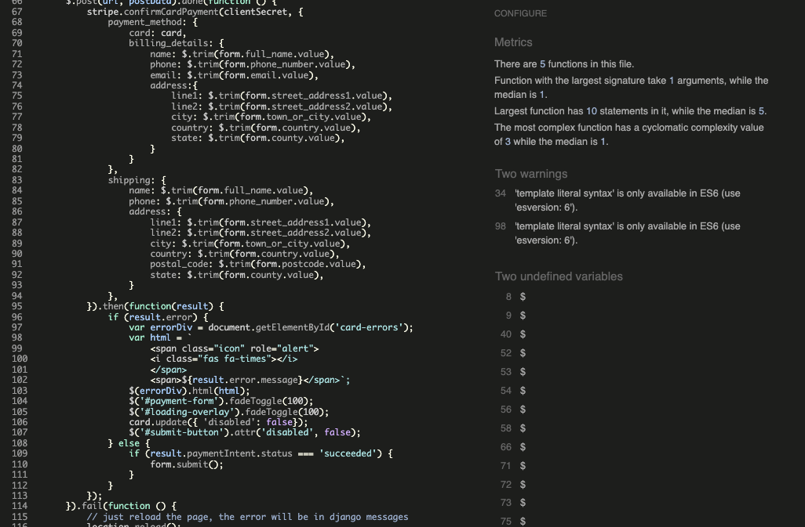
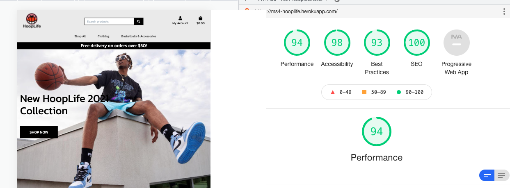
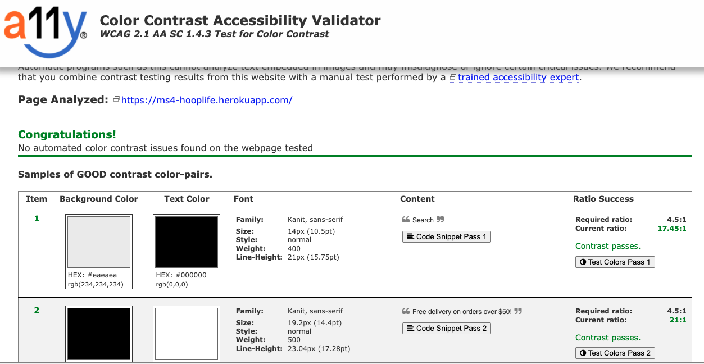
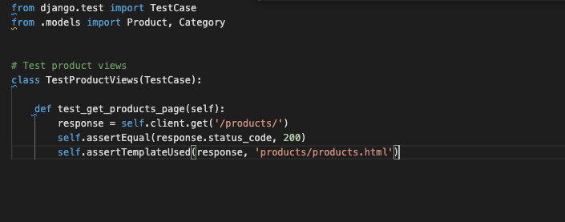
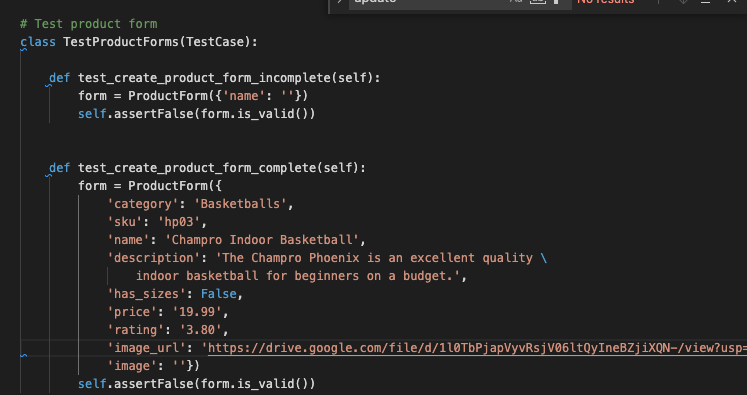
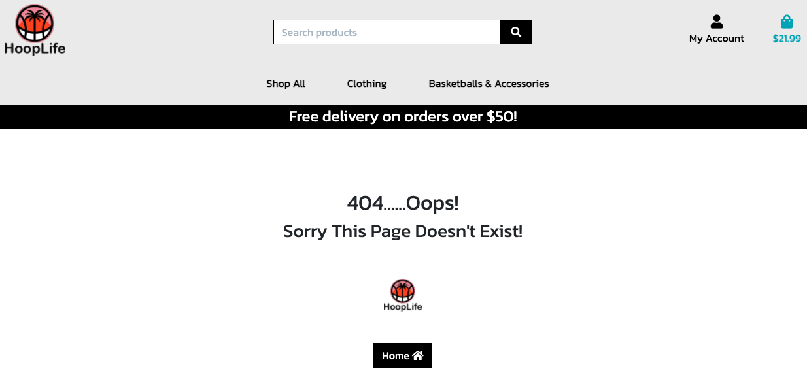
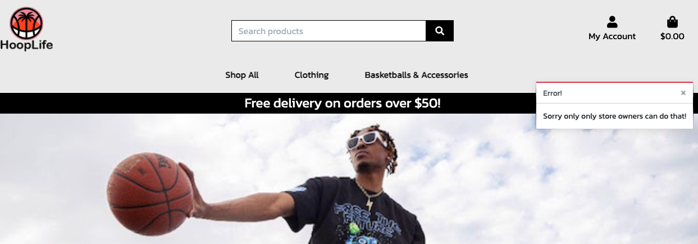

# TESTING.md

# CONTENT QUICK LINKS
## [Users](#user-story-testing)
## [Validation](#code-validation)
## [Manual Tests](#manual-testing)
## [Automated Tests](#automated-testing)
## [Authenticaton](#user-authentication)
## [Forms](#form-validation)
## [Bag](#shopping-bag)
## [Checkout](#checking-out)
## [Email](#emails)
## [Modals](#modal-testing)
## [CRUD](#crud-testing)
## [Bugs](#bugs-test)
## [RETURN TO README](https://github.com/Joe2308/hooplife-ms4/blob/main/README.md)

## User story testing:
1. **As a fan of basketball** I am looking for a website that sells basketball related products and clothing. 

2. **As a shopper** I want to browse products and add them to my cart and checkout securely and quickly.
3. **As a logged in user** I want to save my default delivery details to make my next purchase quicker.

4. **As a visitor** I want to be able to register for an account to view my order history

5. **As a user** I want to be able to log out and in easily

6. **As a user** I want to receive confirmation emails

7. **As a visitor** I want to able to search for products using keywords

8. **As a visitor** I want to search for products by category, rating and price

9. **As a visitor** I want to be able to read product reviews

10. **As a logged in user** I want to be able to Add product reviews

11. **As a logged in user** I want to add, delete and view wishlist items

12. **As a store owner** I want to be able to add, edit and delete products

13. **As a store owner** I want to be able to monitor customer reviews for unsavoury content and delete if necessary

## **[BACK TO TOP](#content-quick-links)** *

## Code Validation:

### **Html**:

I checked all Html pages using the url from my Heroku application to avoid errors due to django templating.

### **CSS**:

All CSS code passed using the [W3C CSS validator](https://jigsaw.w3.org/css-validator/).

### **PEP8 Compliance**:

All code was checked for valid indentation, whitespace, blank line space and line length using 
the [PEP8 validator](http://pep8online.com/). There are still a few warnings for unused modules but it was very near the end of my project and I did not want to delete something that may or may not have effected functionality at that late stage in the project.

### **Javascript Validation**:

All Javascript code was validated using [Jshint validator](https://jshint.com/). My code passed with no major errors.

## **[BACK TO TOP](#content-quick-links)** *

## Manual Testing:

### Responsive Design: 
For this project I decided to use [Bootstrap](https://getbootstrap.com/). Its grid system allows for excellent responsive designs. I used [Chrome Developer Tools](https://developers.google.com/web/tools/chrome-devtools) to check how my application was looking on all screen sizes and adjusted as necessary. I had to use minimal media queries in my css code.

### Call to action buttons:
I checked and rechecked all buttons were working on all devices and were leading to the correct sections of the website. It was also important that I laid out 
my CTA choices in order of priorty.

### External links:
I made sure to check that all links and social media links were directed to the correct URLS and also that my target="_blank" attribute was working. 
All external links open in a new browser tab.

### Internal links:
I made sure to check that all interal links were working correctly to ensure they led to the correct destinations and that there were no broken links. I also checked that using browser back and forward buttons did not cause any errors or break the website.

### Lighthouse performance test:

I used Lighthouse in Chrome devtools to test my website's performance.
I increased my SEO scores by adding meta content for seo description.
I found that testing with lighthouse generated higher scores in incognito mode due to browser caching.

### Accessibility:

I used [a11y](https://color.a11y.com/) to make sure my color contrasts between fonts and backgrounds was acceptable without excessively comprising my vision of the website final design.

## **[BACK TO TOP](#content-quick-links)** *

## Automated Testing

When I fully completed manual testing on all devices I was pretty much at the deadline for submitting this project. For that reason I did not get to try out automated testing on every view function and form. I did get to carry out some automated testing on the products app. I checked my product management form for validation. And I checked that my product template was returning a 200 response status. At this point I made the decision to refactor some CSS to make my project as visually appealing as possible before submission. I will certainly delve deeper into automated testing as I continue to work on this application in the future. 

## **[BACK TO TOP](#content-quick-links)** *

## User Authentication:
I carried out exstensive testing to make sure no user error caused the site to malfunction. To achieve this I would check all urls available to non logged in and logged in users and manually change them in the browser. I got the following results: 

1. **Changing to a url that does not exists**: 
This gave me a 404 error which lets the user know there is no such page and guides them to the home page. 

2. **Changing a user url to an admin url**:
While logged in or authenticated if a user tries to change a url to a url that only admin can access. They are given a warning message that "Only admin can do that!".

3. **Adding Reviews and Wishlists**:
Any action that requires a user to be authenticated will guide them to the sign up form. The login decorator and templating syntax has been used to achieve user authentication.

### Object Id validation:
If an Object Id from the database is not valid the user will get a 404 error. I tested this by manually changing the object id to an unknown id in the browser search bar. 

### Features Available To Non Registerd Users:
I used if statements in my templates to hide some elements of the navigation bar from non registered users. I manually tested this to make sure everything worked as expected.

### Features Only Available to Admin:
I used template if statements to hide some elements of the site from non admin users. I also added user authentication in my back end code to make sure a user could not force their way to admin access. I tested this manually to ensure all worked as expected.

## **[BACK TO TOP](#content-quick-links)** *

## Form Validation:
* All forms have been checked to ensure they are not sent until the required fields have been included in the requested format. 
* Login forms have been checked to ensure users cannot log in with usernames and passwords that do not match in the database.
* Sign up forms have been checked to ensure new users cannot sign up with an existing username password key value from the database.

## **[BACK TO TOP](#content-quick-links)** *

## Shopping Bag:
* The shopping bag page has been tested to show all products and product totals 
* Users can update quantites and sizes and also delete items in their bag

## **[BACK TO TOP](#content-quick-links)** *

## Checking Out:
* The checkout page has been tested to ensure invalid form info or credit card details cannot be used 
* It is important to note that I have used the test version of Stripe and so it will only accept a test credit card details. Type 4242424242 in that order until all credit card details are filled out.
* The checkout process has been tested thoroughly to ensure the order is processed and sent to the user's profile

## **[BACK TO TOP](#content-quick-links)** *

## Emails:
* The sign up process has been tested to ensure that account verification emails are sent to the email the user signed up with 
* When a user completes the checkout process they will receive an email to let them know their order has been processed.

### Modal Testing
Defensive programming has been used to make sure a user does not delete data by accident. To achieve this all delete buttons have been wired up to modals to ask the user if they are sure they want to delete. Modals have been checked to see if their buttons work logically. The cancel button closes the modal while the delete button removes the data from the datbase and redirects the user to the previous page which they came from.

## **[BACK TO TOP](#content-quick-links)** *

## CRUD Testing:
I have inspected the website on all devices to ensure its functionality meets CRUD standards. All users and Admin have the ability to Create, Read, Update and Delete content that belongs to them. 

## **[BACK TO TOP](#content-quick-links)** *

## **[BACK TO TOP](#content-quick-links)** *

## Bugs Test:
* I did not have too many major bugs in my testing. 

* One bug that caused me some concern was my in my add to wishlist functionality. If a user added an item to their wishlist then no other user could add this item. I rectified the problem by adding an instance of the user to the wishlist when it was being created. I had to amend my wishlist model to use a oneToOneField using the built in django auth User model.

* There is one bug remaining on the shopping bag page. When I refactored my shopping bag for smaller screens sizes the increment and decrement buttons on desktop are not disabling. This is due to Javascript searching the DOM for the applied unique ID. I made attempts to change the IDs to shared class names however I could not get this functionality to work effectively on Desktop. I ask fellow students on slack but no one seemed to be able to fix the issue successfully. I will continue to resolve this issue as I seek to enhance my Javascript skills.

* I have checked the dev tools console and python interperater and there do not appear to any unresolved errors other than those noted above in the application. However if time allowed there are many things I would like to tidy up in form of continuity of image size across all templates.

## **[BACK TO TOP](#content-quick-links)** *

